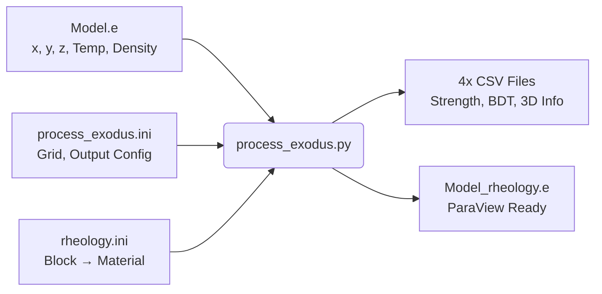

# 🌋 Rheology Data Processing Pipeline

This directory contains batch-processing pipelines designed to evaluate massive geological datasets using the `rheolopy` package. It enables high-throughput computation of differential stress, effective viscosity, and lithospheric strength across 3D grids.

There are two distinct workflows available:
1. **`process_exodus.py`**: The primary processor for complex 3D netCDF/Exodus thermal models (e.g., Alps, Andes).
2. **`process_data.py`** *(Simple CSV processor)*: For basic 3D grid evaluations.

Additionally, a helper script is provided:
- **`generate_rheo_ini.py`**: Automatically generates a rheology `.ini` template from any Exodus mesh file.

---

## 1. Processing Exodus Thermal Models (`process_exodus.py`)

This is the main workhorse for processing large-scale 3D geodynamic models. It reads an Exodus-formatted `.e` (netCDF) file containing a thermal model, uses **true element-block connectivity** to assign the correct material at every 3D node, and integrates the rheology across every vertical column.

**Key capability:** Unlike simple layer-cake approaches, this processor correctly handles complex 3D geometries such as subduction zones, where different rock types (e.g., Oceanic Crust vs. Continental Crust) occupy different spatial regions at the same depth.



### Setting Up a New Model

**Step 1:** Generate the rheology template automatically:
```bash
python generate_rheo_ini.py YourModel.e
```
This reads the Exodus file, detects all element blocks, and writes a template `.ini` file (e.g., `YourModel_rheology.ini`). The script auto-detects `nx`, `ny`, and the block structure.

**Step 2:** Edit the generated `.ini` to assign materials:
```ini
# Before (auto-generated)
Sediments            REPLACE_ME    1e-16
Continental_Crust    REPLACE_ME    1e-16

# After (user-edited)
Sediments            quartzite_gleason_melt   1e-16
Continental_Crust    quartzite_gleason_wet     1e-16
```
Block names must **exactly match** the names stored in the Exodus file.

**Step 3:** Create a `process_exodus.ini` config and run:
```bash
python process_exodus.py process_exodus.ini
```

### Configuration

**`process_exodus.ini`**: Main configuration file.
```ini
# nx and ny after the filename are optional (auto-detected if omitted).
#INPUT_FILE: EXODUS process_rheology/AndesModel.e
#RHEO_FILE: process_rheology/AndesModel_rheology.ini
#ETA_BOUNDS: 1e18 1e25
#OUT_DIR: process_rheology/output
#RESOLUTION: 1000
#WORKERS: 0
```
- `INPUT_FILE`: Path to the `.e` file. Grid dimensions (`nx ny`) are **optional** — omit them and the script auto-detects from unique coordinate pairs.
- `RHEO_FILE`: Path to the block-to-material mapping file.
- `ETA_BOUNDS`: Minimum and maximum viscosity cutoffs (Pa·s).
- `OUT_DIR`: Output directory. The output prefix is derived from the input filename.
- `RESOLUTION`: Vertical integration step size in metres (for the `CONSTANT` resolution output).
- `WORKERS`: Number of parallel processes. Set to `0` (default) to auto-detect all available CPU cores. For a 530K-column mesh, 8 cores can reduce runtime from ~5 hours to ~40 minutes.

**`rheology.ini`**: Maps Exodus element block names to physical materials.
```ini
# Format: Block_Name  Material_ID  Strain_Rate
Sediments              quartzite_gleason_melt   1e-16
Continental_Crust      quartzite_gleason_wet    1e-16
Oceanic_Crust          diabase_maryland_strong  1e-16
Subducting_Slab        olivine_hirth_wet        1e-16
Mantle_Lithosphere     olivine_hirth_dry        1e-16
```
- **Block_Name** must exactly match an Exodus element block name.
- **Material_ID** must exactly match an entry in `rheolopy`'s core `database.json`.
- **Strain_Rate** is specified per block.

### Outputs

The script evaluates the models on both a **CONSTANT** high-resolution grid (defined by `RESOLUTION`) and the **ORIGINAL** Exodus node resolution. It generates the following for *both* modes:

1. **`[prefix]_info3D.csv`**: A dense 3D point cloud containing:
   - Evaluated Temperature and per-node Density
   - `dsigma` (Minimum Yield Strength in MPa)
   - `log_eta_diffusion`, `log_eta_dislocation`, `log_eta_effective` (Viscosities)
   - `bdt` (0 = brittle, 1 = ductile)
   - True block ID and block name at each point
2. **`[prefix]_strength.csv`**: A 2D map of vertically integrated quantities:
   - Total lithospheric strength & Crustal strength
   - Thickness-averaged viscosities for the crust and mantle
3. **`[prefix]_thickness.csv`**: A 2D map of Mechanical Thickness ($H_{mech}$) and decoupled elastic thickness ($T_e$).
4. **`[prefix]_bdt.csv`**: 2D depths of the Brittle-Ductile Transition.
5. **`[prefix]_rheology.e`**: A copy of the input Exodus file with the 3D rheological variables (`log_dsigma`, `log_eta_eff`, `bdt`, etc.) appended as nodal variables. **This file can be opened directly in ParaView for 3D visualization.**

---

## 2. Processing Simple CSV Grids (`process_data.py`)

For simpler workflows, this script processes a standard CSV point cloud.

### Configuration
Driven by `config.ini`:
```ini
[General]
strain_rate = 1e-17

[Settings]
inputfile = input.csv
outputfile = output.csv
rheology_law = olivine_hirth_dry
```

### Inputs & Outputs
**Input (`input.csv`)**: Must contain columns for `x`, `y`, `depth`, `Pressure`, `Temperature`, and `Density`.  
**Output (`output.csv`)**: Appends three new physical quantities to every coordinate:
- `dsigma_c`: Differential stress under **compression** (Pa)
- `dsigma_e`: Differential stress under **extension** (Pa)
- `Viscosity`: Effective geological viscosity (log10 Pa·s)

---

## Execution

1. **Install Dependencies:**
   Ensure the core package is installed:
   ```bash
   pip install -e ../
   ```

2. **Generate and edit the rheology template** (for new meshes):
   ```bash
   python generate_rheo_ini.py YourModel.e
   # Edit the generated .ini file to assign materials
   ```

3. **Run the processor:**
   ```bash
   python process_exodus.py your_config.ini
   ```

## Performance Notes
Both processors are designed to handle large files (100MB+ grids). `process_exodus.py` performs computationally intensive column-by-column vertical integrations. The block-mapping step reads all element connectivity arrays once upfront, then processing scales linearly with the number of horizontal columns.
