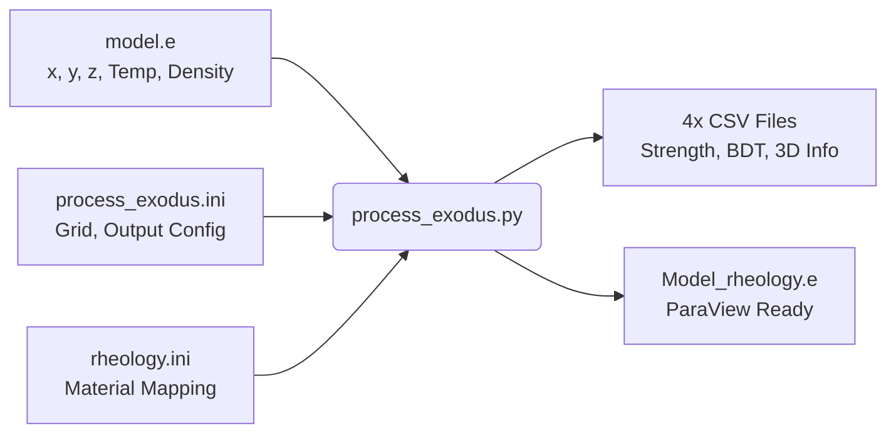

# Rheology Data Processing Pipeline

This directory contains batch-processing pipelines designed to evaluate massive geological datasets using the `rheolopy` package. It enables high-throughput computation of differential stress, effective viscosity, and lithospheric strength across 3D grids.

There are two distinct workflows available:
1. **`process_exodus.py`**: The primary processor for complex 3D netCDF/Exodus thermal models.
2. **`process_data.py`** *(Simple CSV processor)*: For basic 3D grid evaluations.

---

## 1. Processing Exodus Thermal Models (`process_exodus.py`)

This is the main workhorse for processing large-scale 3D geodynamic models. It reads an Exodus-formatted `.e` (netCDF) file containing a thermal model, maps structural element blocks to laboratory flow laws, and integrates the rheology across every vertical column.



### Configuration & Inputs

**1. `process_exodus.ini`**: Main configuration file.
```ini
#INPUT_FILE: EXODUS process_rheology/model.e 119 96
#RHEO_FILE: process_rheology/rheology.ini
#ETA_BOUNDS: 1e18 1e25
#OUT_DIR: process_rheology/output model
#RESOLUTION: 1000
```
- `INPUT_FILE`: Path to the `.e` file, followed by the grid dimensions (`nx`, `ny`).
- `RHEO_FILE`: Path to the material mapping file.
- `ETA_BOUNDS`: Minimum and maximum viscosity cutoffs (Pa·s).
- `RESOLUTION`: Vertical integration step size in meters (for the `CONSTANT` resolution output).

**2. `rheology.ini`**: Maps Exodus element blocks to physical materials.
```ini
# Format: Layer_Name  Material_ID  Strain_Rate  Common_Layers
UpperCrust        quartzite_gleason_wet    1e-16        5
LithMantle        olivine_hirth_dry        1e-15        5
```
- **Material_ID** must exactly match an entry in `rheolopy`'s core `database.json`.
- The processor will automatically substitute bulk densities defined in the Exodus file if they are available.

### Outputs from `process_exodus.py`

The script evaluates the models on both a **CONSTANT** high-resolution grid (defined by `RESOLUTION`) and the **ORIGINAL** Exodus node resolution. It generates the following for *both* modes:

1. **`[prefix]_info3D.csv`**: A dense 3D point cloud containing:
   - Evaluated Temperature and Density
   - `dsigma` (Minimum Yield Strength in MPa)
   - `log_eta_diffusion`, `log_eta_dislocation`, `log_eta_effective` (Viscosities)
   - `bdt` (0 = brittle, 1 = ductile)
2. **`[prefix]_strength.csv`**: A 2D map of vertically integrated quantities:
   - Total lithospheric strength & Crustal strength
   - Thickness-averaged viscosities for the crust and mantle
3. **`[prefix]_thickness.csv`**: A 2D map of Mechanical Thickness ($H_{mech}$) and decoupled elastic thickness ($T_e$).
4. **`[prefix]_bdt.csv`**: 2D depths of the Brittle-Ductile Transition.
5. **`[prefix]_rheology.e`**: A direct copy of the input Exodus file with the 3D rheological variables (`log_dsigma`, `log_eta_eff`, `bdt`, etc.) appended as nodal variables. **This file can be opened directly in ParaView for stunning 3D visualization.**

---

## 2. Processing Simple CSV Grids (`process_data.py`)

For simpler workflows, this script processes a standard CSV point cloud.

### Configuration
Driven by `config.ini`:
```ini
[General]
strain_rate = 1e-17

[Settings]
inputfile = input.csv
outputfile = output.csv
rheology_law = olivine_hirth_dry
```

### Inputs & Outputs
**Input (`input.csv`)**: Must contain columns for `x`, `y`, `depth`, `Pressure`, `Temperature`, and `Density`.  
**Output (`output.csv`)**: Appends three new physical quantities to every coordinate:
- `dsigma_c`: Differential stress under **compression** (Pa)
- `dsigma_e`: Differential stress under **extension** (Pa)
- `Viscosity`: Effective geological viscosity (log10 Pa·s)

---

## Execution

1. **Install Dependencies:**
   Ensure the core package is installed:
   ```bash
   pip install -e ../
   ```

2. **Navigate and Run:**
   ```bash
   cd process_rheology
   python process_exodus.py process_exodus.ini
   ```

## Performance Notes
Both processors are designed to handle large files (100MB+ grids). `process_exodus.py` performs computationally intensive column-by-column vertical integrations. Wait times on standard desktop hardware for high-resolution `.e` grids generally range from 1 to 5 minutes.
